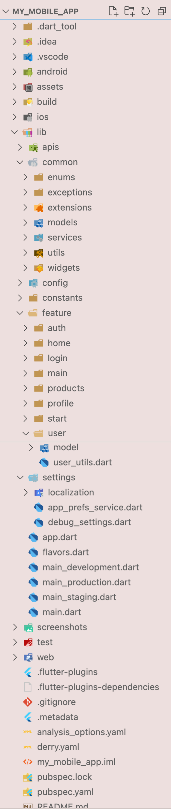

# My Mobile App

A simple Flutter project created using BLoC state management. It consists of login page, product list page with pagination, CRUD operations for product & profile page

## Prerequisites

1. [Derry](https://github.com/frencojobs/derry) - To enable script shortcuts. Optional but nice to have.

## Running the project for the first time

1. Install all required dependencies for the project

    <details>
	
	```
	flutter clean
	flutter pub get
	cd ios
	pod install
	```
	Alternatively, if you have Derry installed, you may run the following command:
	```
	derry get
	```
	
    </details>
    
3. Generate all localization and build_runner files.

    <details>
	
	```
	flutter pub run easy_localization:generate -S assets/lang -f keys -o locale_keys.g.dart -O lib/settings/localization
	```
	Alternatively, if you have Derry installed, you may run the following command:
	```
	derry locale
	```
	
    </details>
    
4. Set up your .env files.
    
    <details>

	<summary>For a new project</summary>

	If this is a brand new project, create the following files in the `lib/config` folder:
	```
	config
	|- .env.development
	|- .env.production
	|- .env.staging
	```
	Then, update all three `.env` files to include the following lines of code:
	```
	BASE_URL = "www.google.com"
	API_KEY = "HELLO THIS IS DEV API KEY"
	API_SECRET = "DEV API SECRET"
	```
	
	</details>

    <details>

	<summary>For an existing project</summary>
	
	Retrieve the existing `.env` files and paste them into the `lib/config` folder.
    </details>
    
    <details>

	<summary>After adding the `.env` files</summary>
	
	Generate `Env()` by running these commands:
	```
	flutter pub run build_runner clean
	flutter packages pub run build_runner build --delete-conflicting-outputs
	```
	Alternatively, if you have Derry installed, you may run the following command:
	```
	derry clean_build_runner
	```
	If you have `development_env.g.dart`  `production_env.g.dart` and `staging_env.g.dart` files in the `config` folder, you are on the right path.

	</details>

4. Run the project

## Notable Dependencies

To effectively work on this project, it's essential to have a good understanding of the following Flutter dependencies. Here are the links to their respective pub.dev pages for additional reading and documentation:

1. Data class generation - [freezed](https://pub.dev/packages/freezed)
2. Localizations - [easy_localization](https://pub.dev/packages/easy_localization)
3. Local database - [isar](https://pub.dev/packages/isar)
4. Environment variables - [envied](https://pub.dev/packages/envied)

## Useful Commands

Refer to [derry.yaml](derry.yaml) for a list of command shortcuts.

## Project Structure

</img>

### Entrypoint

Refer to `main.dart` and `app.dart` to configure project startup settings.

### Project Folders

#### `assets` folder

The files here include `images`, `icons` files and `language json` files.

#### `common` folder
The folders here should be for files that will be commonly used for the entire project.

**Note:** The `widgets` in the `common` folder should only include widgets that are commonly used throughout the entire project. 

**Example:** Text fields, image wrappers, dialog boxes, snackbars etc.

#### `constants` folder

For any properties or values that are commonly used.

#### `feature` folder
This project is using a [feature-first project structure](https://codewithandrea.com/articles/flutter-project-structure/).

The structure of each `feature` folder are as follows:
  ```
  name_of_feature/
  ├── bloc/
  │   ├── feature_bloc.dart
  │   ├── feature_event.dart
  │   └── feature_state.dart
  ├── model/
  │   ├── feature_model.dart
  ├── pages/
  │   ├── feature_page_A.dart
  │   ├── feature_page_B.dart
  ├── widgets/
  │   ├── feature_widget_A.dart
  │   ├── feature_widget_B.dart
  │   ├── feature_widget_C.dart
  ├── sub_feature_1/
  │   ├── bloc/
  │   ├── model/
  │   ├── pages/
  │   └── widgets/
  ├── sub_feature_2/
  │   ├── bloc/
  │   ├── model/
  │   ├── pages/
  │   └── widgets/
  ├── feature_utils.dart
  └── feature.dart (barrel file)
  ```

#### `settings` folder

Used to configure app settings such as `localizations` and `themes`.

